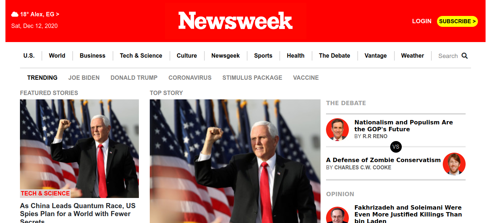

# Newsweek-clone

Build clone of newsweek.com home page on all screens

Clone of newsweek.com home page. [thenextweb](https://www.newsweek.com/)

## Built With

- Html
- Css

## Live Demo

[Live Demo Link](https://ammarkandel.github.io/newsweek-clone/)

👤 **Ammar El refay Kandel**

- GitHub: [ammarkandel](https://github.com/ammarkandel)
- Twitter: [@AmmarQandel](https://twitter.com/AmmarQandel)
- LinkedIn: [LinkedIn](https://www.linkedin.com/in/ammar-kandel-7b4100193/)

👤 **Manuel Aldaraca**

- Github: [@vicmaburrito](https://github.com/vicmaburrito)
- Twitter: [@ManuelAldaraca](https://twitter.com/ManuelAldaraca) 
- LinkedIn: https://www.linkedin.com/in/manuel-aldaraca 

#### Contributions, issues and feature requests are welcome! Start by:

- Push your branch up to your forked repository
- Open a Pull Request with a detailed description to the development branch of the original project for a review

## Show your support

Give a ⭐️ if you like this project!

## Acknowledgments

- Microverse
